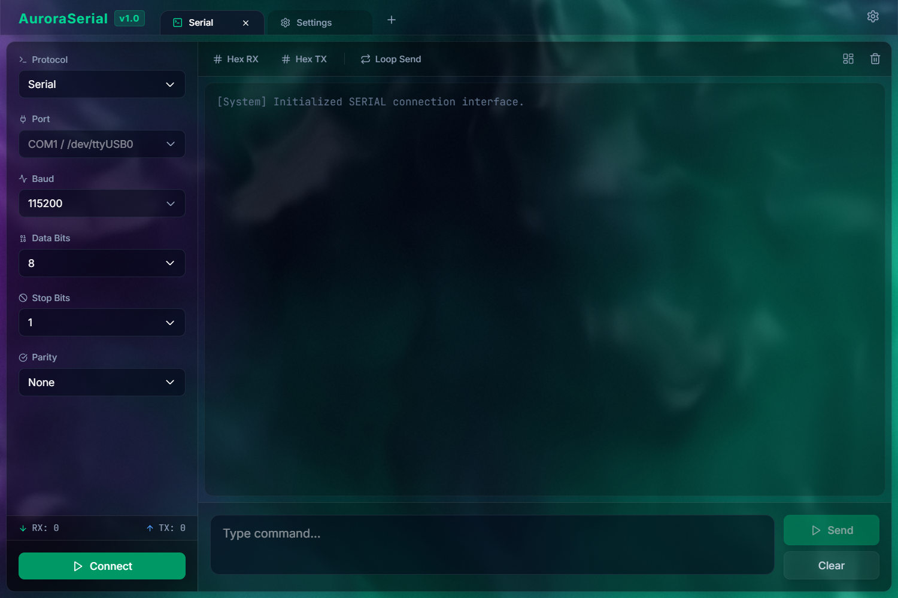
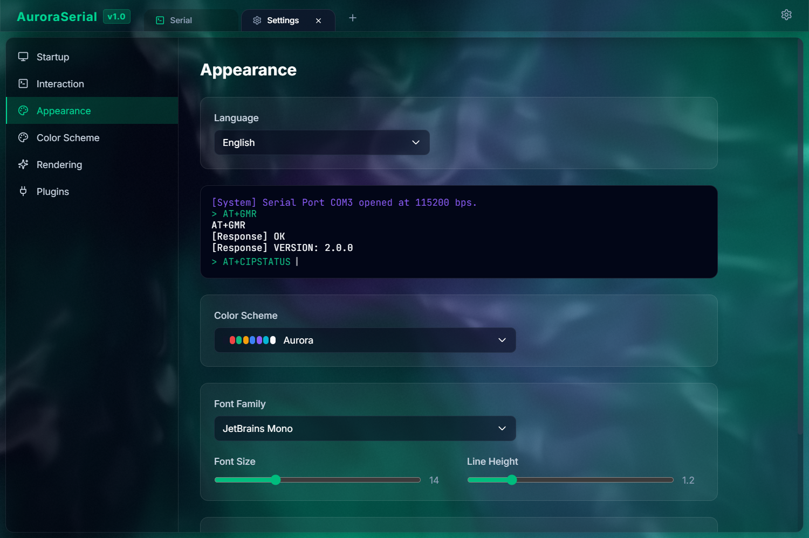

<div align="center">
  
  <h1>Aurora Terminal</h1>
  <p>一个基于 Rust 和 React 构建的高性能、可扩展、现代化的终端模拟器。</p>

  <p>
    <span>简体中文</span> | <a href="README.md">English</a>
  </p>

  <p>
    <a href="https://github.com/tauri-apps/tauri"></a>
    <a href="https://reactjs.org/"></a>
    <a href="https://www.rust-lang.org/"></a>
    <a href="LICENSE"></a>
    
  </p>
</div>

<br>

<div align="center">
  
  <br><br>
  
</div>

## ✨ 特性

- **🚀 高性能**: 基于 Tauri 和 Rust 构建，确保极低的内存占用和极快的执行速度。
- **🔌 API 驱动的插件架构**: 使用 WASM (Extism) 或 Lua (mlua) 扩展功能。无需修改核心 Rust 代码即可添加新协议 (SSH, MQTT, Telnet)。
- **🎨 现代 UI**: 使用 React, Tailwind CSS 和 Framer Motion 构建的时尚、可定制的界面。
- **🌍 国际化**: 内置多语言支持，并具有持久化设置。
- **🛠️ 开发者友好**: 易于使用的插件系统，采用 JSON-RPC 通信。

## 🏗️ 架构

Aurora Terminal 使用独特的 **微内核 + 消息传递** 架构：

- **宿主 (Rust)**: 提供原始 I/O 功能 (TCP, 串口等) 和 UI 渲染。
- **插件 (WASM/Lua)**: 作为状态机，通过 JSON-RPC 处理协议逻辑和数据处理。

有关插件开发的更多详细信息，请参阅 [插件开发指南](docs/PLUGIN_DEVELOPMENT_zh.md)。

## 🚀 快速开始

### 前置要求

- [Node.js](https://nodejs.org/) (v18 或更高版本)
- [Rust](https://www.rust-lang.org/tools/install)
- [Tauri 前置要求](https://tauri.app/v1/guides/getting-started/prerequisites) (特定于操作系统的构建工具)

### 安装

1. 克隆仓库:
  ```bash
  git clone https://github.com/Aurora-Link-Org/Aurora-Terminal.git
  cd Aurora-Terminal
  ```

2. 安装前端依赖:
  ```bash
  cd src
  npm install
  # 如果存在 ui 目录，也需要安装其依赖
  if [ -d "ui" ]; then
    cd ui
    npm install
    cd ..
  fi
  cd ..
  ```

3. 生成应用图标 (首次运行或构建前必须执行):
  ```bash
  npx @tauri-apps/cli@^2.0.0 icon images/logo-background.png
  ```

4. 在开发模式下运行 (这会自动启动 React 前端和 Rust 后端):
  ```bash
  npx @tauri-apps/cli@^2.0.0 dev
  ```

5. 构建生产版本 (这会自动将前端和后端编译打包成一个可执行文件):
  ```bash
  npx @tauri-apps/cli@^2.0.0 build
  ```

## 📚 文档

- [插件开发指南 (中文)](docs/PLUGIN_DEVELOPMENT_zh.md)
- [Plugin Development Guide (English)](docs/PLUGIN_DEVELOPMENT.md)

## 🤝 贡献

欢迎贡献！请随时提交 Pull Request。

1. Fork 项目
2. 创建您的特性分支 (`git checkout -b feature/AmazingFeature`)
3. 提交您的更改 (`git commit -m 'Add some AmazingFeature'`)
4. 推送到分支 (`git push origin feature/AmazingFeature`)
5. 打开一个 Pull Request

## 📄 许可证

本项目采用 GPL-3.0 许可证 - 有关详细信息，请参阅 [LICENSE](LICENSE) 文件。
